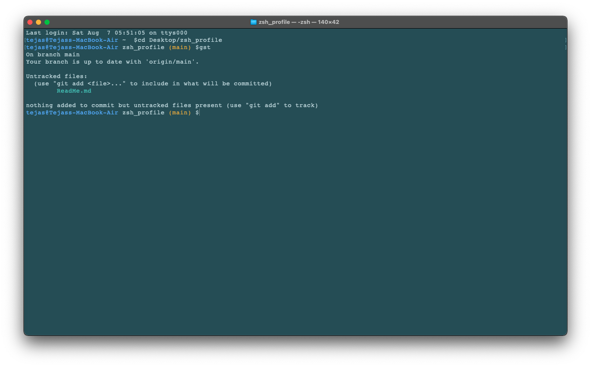

# Introduction
Use this repository to change your zsh profile in your Mac. There are some lazy commands that I often use, such as `gst` instead of `git status`.

# Preview
Here is how the terminal looks like.

# Installation
To install, clone the repo, open the `Solarized Dark.terminal` file and go to preferences to make it as default.  
Clone the repo in the _home_ `~` folder.
Add `source ~/zsh_profile/.zshrc` in your `~/.zshrc`
Restart the terminal.  
